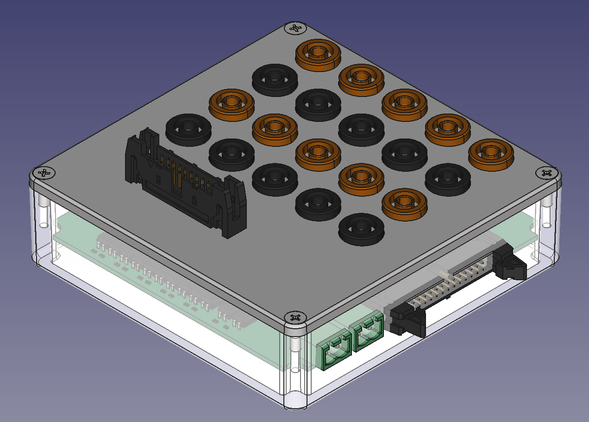
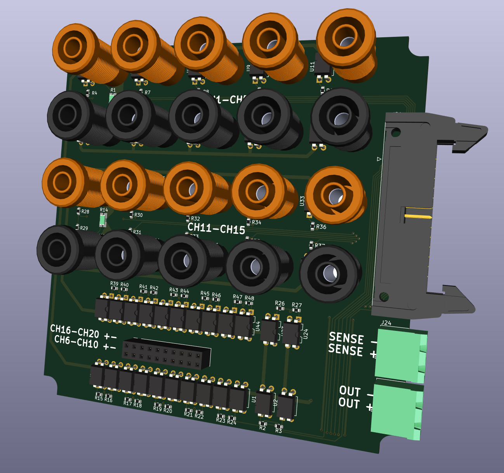
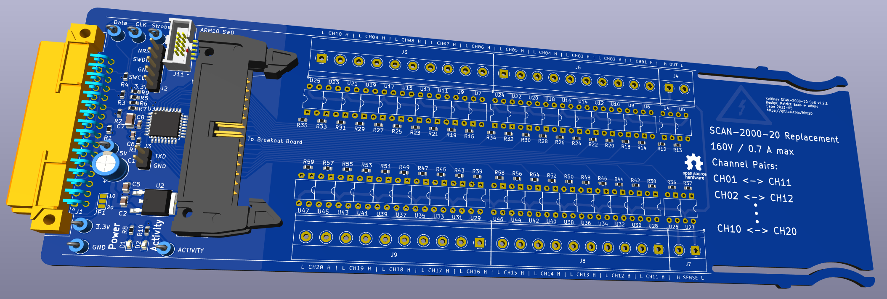
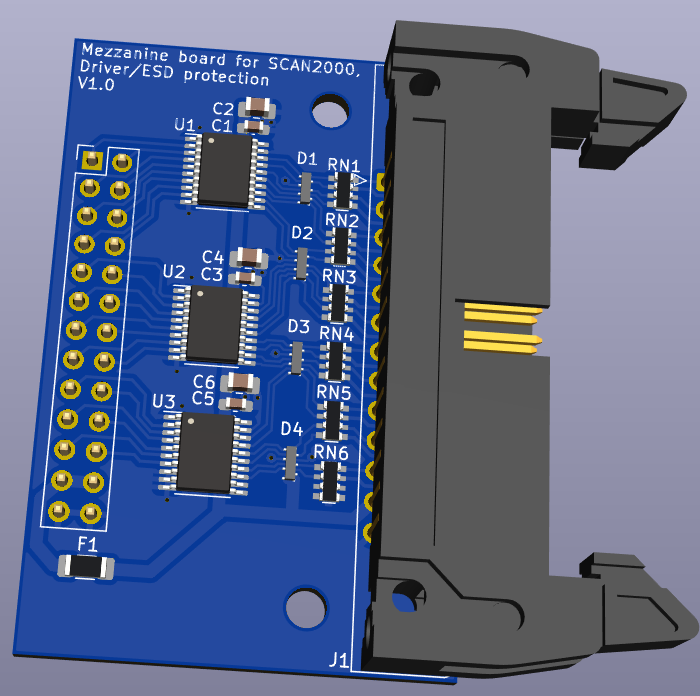

# SCAN2000_breakout

This repository contains the KiCAD and Freecad project files for a breakout panel for for a Keithley SCAN2000 replacement card. It is a specific breakout board in the sense that it holds the (solid-state) relays inside, lowering the overal electrical noise.

It is supposed to be matched with the board from [here](https://github.com/hb020/SCAN2000):

either directly, either via a small mezzanine driver/ESD suppression board that can be found in the [/SCAN2000_driver](/SCAN2000_driver) directory.
.
That latter board will give a bit more protection against electrical mishaps, and will allow a load of up to 24 or 35mA per pin (depending on the chip manufacturer), instead of 15mA, allowing extra leds to be driven.

One day I might integrate it in the SCAN2000 board.

More documentation to come..
