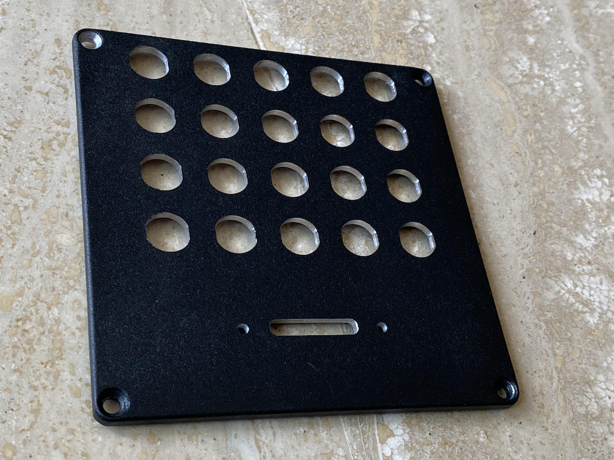

# SCAN2000_breakout

This repository contains the KiCAD and Freecad project files for a breakout panel for for a Keithley SCAN2000-20 replacement card. 

It is a specific breakout board in the sense that it holds the (solid-state) relays inside, lowering the overal electrical noise.

It is supposed to be matched with the board from [here](https://github.com/hb020/SCAN2000):

either directly, either via a small mezzanine driver/ESD suppression board that can be found in the [/SCAN2000_driver](/SCAN2000_driver) directory.

That latter board will give a bit more protection against small electrical mishaps, and will allow a load of up to 24 or 35mA per pin (depending on the chip manufacturer), instead of 15mA, allowing extra leds to be driven.

To facilitate plugging/unplugging from the DMM, I also made a small 4 pin connector board for the back of the DMM. See the [/SCAN2000_rearconn](/SCAN2000_rearconn) directory.

# Functionality

The board provides 20 channels:

* 2 banana inputs meant for current measurements. It uses 100 mOhm kelvin shunts, allowing up to 2A. One could go higher with lower shunt values or larger package sizes. Note that the accuracy in the µA range suffers from the noise and leak currents in the SSR. This means that if you want a higher current handling capacity, you will sacrifice low current accuracy. And the reverse of course. There are 2 inputs like it, so you are free to adjust, and you can always use external shunts.
* 8 banana inputs for voltage measurements or 4W resistance measurements.
* 10 pin header inputs for voltage measurements or 4W resistance measurements.

# Production

The case chosen is a Hammond 1590QBK. It is just small enough to fit everything required inside, and not be a space hogger on my desk. It machines well, even on my rather low end CNC:

The Freecad files, the GCode, as well as the front stickers, are in the [/freecad](/freecad) directory.
The paint on it is not completely flat, making sticker adhesion a bit more difficult and making milled text not practical.

The grounding of the case is done through a threaded rivet in the case that is connected to the ground screw on the rear of the DMM via the shielding of the OUT cable.

# TODO

* Integrate the mezzanine board in the SCAN2000 board. But then I should also replace the ESD diodes by a real overvoltage protection. The used diodes are effective against some types of ESD, but get damaged easily with DC currents. And hand soldering them isn't easy.
* Find a black 26 pin flat cable header, the white ones I got now hurts the eyes.
* Use nicer connectors than the MSTB 5.08 connectors. The OUT/SENSE cables that I used to connect to the DMM are shielded, making them just a bit stiff, so I had to use MSTB 2,5/ 2-STZ-5,08 connectors that have strain relief. It would be better to move to a regular 4 or 5 pin connector.
* Make a 3D printed case for the rearconn connector. I just applied plastic coating to the PCB, not ideal.

